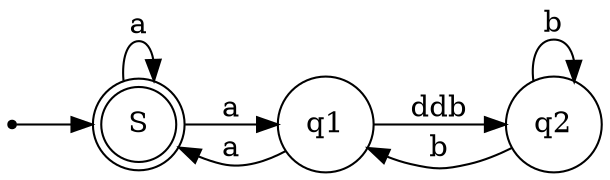

# Graphs

## Topological Sort
Topological sort is useful for resolving dependency chains or figuring out if a graph is a directed acylic graph.

```dot
digraph finite_state_machine {
    rankdir=LR;
    size="8,5"

    node [shape = doublecircle]; S;
    node [shape = point ]; qi

    node [shape = circle];
    qi -> S;
    S  -> q1 [ label = "a" ];
    S  -> S  [ label = "a" ];
    q1 -> S  [ label = "a" ];
    q1 -> q2 [ label = "ddb" ];
    q2 -> q1 [ label = "b" ];
    q2 -> q2 [ label = "b" ];
}
```