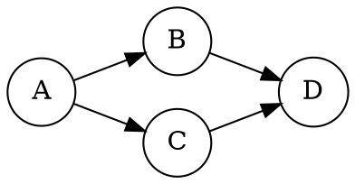
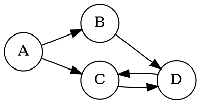

# Topological Sort

Topological sort is commonly used for resolving dependency graphs or job scheduling. The algorithm only works if the graph is **acyclic**. However, it can be applied to find find out whether a graph is acyclic or cyclic.

For example, given the graph below, the topological order for the graph is `ABCD` or `ACBD`.

The graph below is non-resolvable by topological sort because D has a dependency on A. [Kahn's algorithm](#breadth-first-search-approach-kahns-algorithm) would return an incomplete ordering of nodes (i.e. `AB`).

## Breadth First Search Approach (Kahn's Algorithm)

The intuition here is to start at the top of the dependency tree and removing each node. Once the [in-degree](https://xlinux.nist.gov/dads/HTML/indegree.html) of a node reaches zero, remove it and add it to the sort order.

1. Compute the in-degree of each node
2. Add all nodes with zero dependents into a queue
3. As each node is removed from the queue, append the node to the result list and for each of its children (dependencies):
    1. Decrement its ingress count
    2. Add it to the queue if ingress count reaches 0
4. When the queue is empty, if the number of nodes in the resulting list is less than the number of nodes, the ordering cannot be resolved (the graph is cyclic).

If the graph is **cyclic** the algorithm will report an incomplete ordering. It will reach a point where there is at least two nodes that have an in-degree greater than zero. This property is useful for detecting cycles within a graph.

## Depth First Search Approach

Intuition: Recursively traverse the graph and mark each node as visited. If a node is already visited, skip it. When a leaf is discovered, add nodes to a stack during backtracking. Unlike the BFS approach, the topological ordering is in reverse order because we traverse the bottom of the dependency graph and add it to the ordering.

1. For each node, recursively traverse the graph
2. Mark each node as visited
3. During backtracking, add the node onto a stack
4. Pop each node of the stack for the topological order

The shortcoming of this approach is that it doesn't detect cycles in the graph (although you can use DFS with a few modifications to do so).

## Problems

[Course Scheduling](https://leetcode.com/problems/course-schedule)
