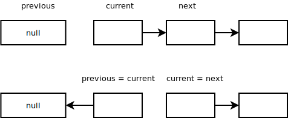
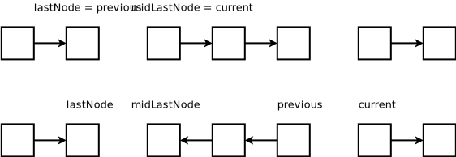

# Linked List Reversal

The important thing to recognize here is that you'll need to store the pointer to the next item in the list prior to pointing the current pointer to the previous item.

In total, you'll need to keep track of three pointers.
1. `current`: This is the current node in the list that you're processing
2. `previous`: This is the head of the newly reversed list
3. `next`: Points to the next item in the list. Without this, when you update `current` to point to `previous`, you'll lose reference to the original list.

The algorithm will then look like this:

1. For the `current` node, save its `next` node in a temp variable
2. Point the current node's next pointer to the `previous` item
3. Update `previous` pointer to store the `current` node
4. Update `current` to store the `next` temp variable from step 1

Do this until the `current` node becomes null and then return `previous`, which is now the head of the new list. 

Can think of this as two parts. Steps 1-2 can be thought of "processing steps" where we're actually reversing the list. Steps 3-4 can be thought as "update" steps.

## Reversing Sub-lists

For reversing a subsection of the list, think of the list as three separate lists. The first untouched portion, the middle reversed portion and the last untouched portion. Apply the algorithm to the mid section and recombine the three sub-lists.

To recombine, you'll need to store the last node in the first section and the first node in the last section.

When arriving at the sublist to reverse, store the last node of the first list (`previous`) and what will be the last node of the middle list after reversing(`current`). The diagram below shows why we need to store these as they will be needed when recombining the sublists.

After reversing, we can recombine the lists by setting `lastNode.next = previous` and `midLastNode.next = current`.